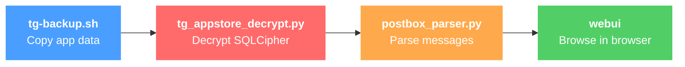
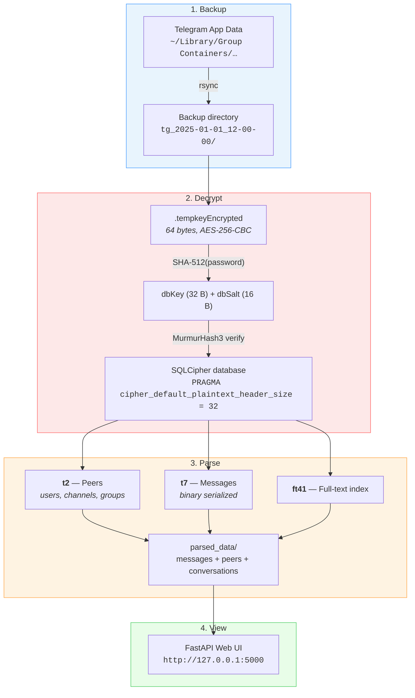
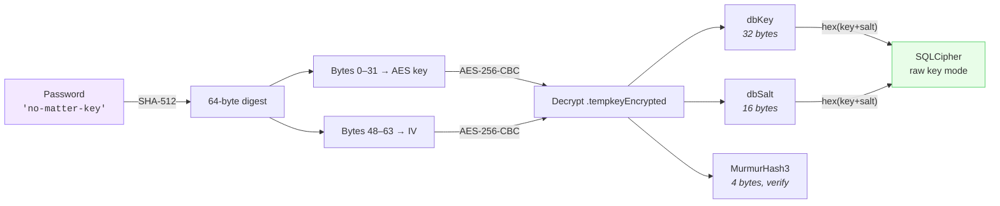
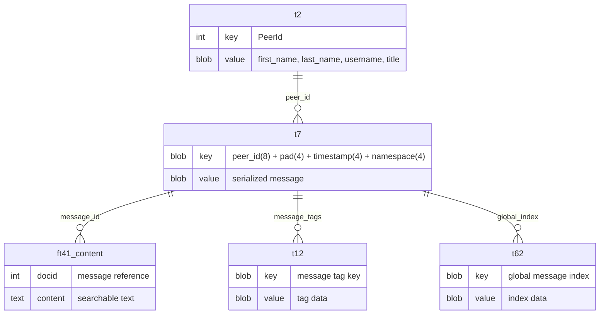

# Telegram Data Viewer

macOS toolkit for extracting, decrypting, and browsing Telegram messages — including deleted messages and secret chats.

> All processing is local and offline. No network connections, no API calls.

## How it works



`./tg-viewer full` runs the entire pipeline in one command.

## Quick start

```bash
# 1. Install dependencies
pip install -r requirements.txt

# 2. Full automated workflow (backup + decrypt + parse + web UI)
./tg-viewer full

# 3. Clean up when done
./tg-viewer clean
```

> Quit Telegram before running backup to avoid database locks.

## Step-by-step usage

```bash
./tg-viewer backup ./data           # Copy Telegram data
./tg-viewer decrypt ./data/tg_*/    # Decrypt databases
./tg-viewer parse ./data/tg_*/      # Parse messages into conversations
./tg-viewer webui ./data/tg_*/parsed_data   # Browse in web UI
```

Or call the scripts directly:

```bash
./tg-backup.sh ./data
python3 tg_appstore_decrypt.py ./data/tg_*/
python3 postbox_parser.py ./data/tg_*/
python3 -m webui ./data/tg_*/parsed_data
```

## Common scenarios

### Browse a previously-extracted backup

If you've already run the pipeline and just want to open the web UI again, point it at the backup root or the `parsed_data/` directly — both work:

```bash
./tg-viewer webui ./tg_2026-04-26_01-26-40                  # auto-descends into parsed_data/
./tg-viewer webui ./tg_2026-04-26_01-26-40/parsed_data      # explicit form
./tg-viewer webui ./tg_2026-04-26_01-26-40 --port 5050      # custom port
./tg-viewer webui ./tg_2026-04-26_01-26-40 --host 0.0.0.0   # bind all interfaces (LAN access)
```

### Re-parse without re-backing-up

The parser is idempotent — re-running it overwrites `parsed_data/` in place. Useful after pulling parser updates or tweaking extraction logic:

```bash
./tg-viewer parse ./tg_2026-04-26_01-26-40
# then reload the web UI
./tg-viewer webui ./tg_2026-04-26_01-26-40
```

You can also call the parser directly to use extra flags:

```bash
python3 postbox_parser.py ./tg_2026-04-26_01-26-40                                # all accounts
python3 postbox_parser.py ./tg_2026-04-26_01-26-40 --account 12103474868840298699 # one account
python3 postbox_parser.py ./tg_2026-04-26_01-26-40 --output ./custom-out          # custom output dir
python3 postbox_parser.py ./tg_2026-04-26_01-26-40 --password "your_passcode"     # custom passcode
python3 postbox_parser.py ./tg_2026-04-26_01-26-40 --redact                       # mask paths/IDs in logs
```

### Re-decrypt only (faster than full pipeline)

If you only need fresh `decrypted_data/` (for example to inspect raw SQLite tables), skip the parser:

```bash
./tg-viewer decrypt ./tg_2026-04-26_01-26-40
# or directly:
python3 tg_appstore_decrypt.py ./tg_2026-04-26_01-26-40 --output ./decrypted-out
```

### Process an externally-imported account

If you copied an account directory from another machine and have its `.tempkeyEncrypted` (e.g. into `tg_imported_docs/`), the parser handles it the same way — just point at the wrapper directory containing both:

```
tg_imported_docs/
  .tempkeyEncrypted              # required to decrypt
  account-11371877790030934133/
    postbox/
      db/db_sqlite
      media/
```

```bash
python3 postbox_parser.py ./tg_imported_docs --output ./tg_imported_docs/parsed_data
./tg-viewer webui ./tg_imported_docs/parsed_data
```

If you have the raw `dbKey` + `dbSalt` instead of `.tempkeyEncrypted`, pass them explicitly:

```bash
python3 postbox_parser.py ./tg_imported_docs \
    --db-key   <64-hex-chars> \
    --db-salt  <32-hex-chars>
```

### Inspect parsed data without the web UI

Each account's JSON output is human-readable and can be queried with `jq`:

```bash
# All conversations sorted by message count
jq '.[] | {name: .peer_name, count: .message_count}' \
    tg_2026-04-26_01-26-40/parsed_data/account-*/conversations_index.json

# Outgoing-only messages from a specific peer
jq '.[] | select(.peer_id == 15868844285 and .outgoing == true) | .text' \
    tg_2026-04-26_01-26-40/parsed_data/account-*/messages.json

# Total media size by type
jq '[.[] | {type: .media_type, size: .size_bytes}] | group_by(.type)
    | map({type: .[0].type, count: length, mb: ([.[].size] | add / 1048576)})' \
    tg_2026-04-26_01-26-40/parsed_data/account-*/media_catalog.json
```

### Run on a custom passcode

If you've set a Telegram local passcode, pass it through the workflow:

```bash
TG_PASSCODE="your_passcode"   # used by webui's auto-detection
python3 tg_appstore_decrypt.py ./tg_2026-04-26_01-26-40 --password "your_passcode"
python3 postbox_parser.py     ./tg_2026-04-26_01-26-40 --password "your_passcode"
```

### Privacy-preserving runs (`--redact`)

Mask account IDs, encryption keys, absolute paths, and personal names in console output — useful for sharing logs or screen-recording:

```bash
./tg-viewer --redact full
TG_REDACT=1 ./tg-viewer full              # equivalent via env var
python3 postbox_parser.py ./data --redact
python3 tg_appstore_decrypt.py ./data --redact
```

Names are masked structurally (`"Alice Smith"` → `"A**** S****"`) so the log stays readable while leaking nothing useful. Redaction applies to terminal output only — JSON outputs and the web UI are unchanged.

### Multiple accounts at once

The parser auto-discovers every `account-*/` directory under the backup root. If you only want one:

```bash
python3 postbox_parser.py ./tg_2026-04-26_01-26-40 --account 12103474868840298699
```

The web UI loads every account directory it finds in `parsed_data/`, so the Chats / Media / Users tabs aggregate across all accounts. Each result row carries the `_account` field so you can tell which account it came from.

### Cleaning up

```bash
./tg-viewer clean      # interactive: lists every tg_*/ directory at the project root and asks before deleting
```

Note: `clean` only touches `tg_*/` directories at the project root. Custom output paths or `tg_imported_docs/` are left alone — delete those manually if needed.

### Extraction results

From a real run on 4 accounts:

| Metric | Result |
|--------|--------|
| Databases decrypted | 4/4 (100%) |
| Messages extracted | 1,430,103 |
| Peers identified | 83,364 |
| Conversations | 402 |
| Media files catalogued | 27,595 (photos, videos, audio, stickers, documents) |
| Cached/deleted (FTS) | 588 |
| Metadata noise | 0% |

## Commands

| Command | Description |
|---------|-------------|
| `./tg-viewer full [DIR]` | Run complete workflow: backup, decrypt, parse, web UI |
| `./tg-viewer backup [DIR]` | Create backup of Telegram data |
| `./tg-viewer decrypt DIR` | Decrypt databases (App Store `.tempkeyEncrypted`) |
| `./tg-viewer parse DIR` | Parse Postbox binary format into messages/peers/conversations |
| `./tg-viewer webui DIR` | Start web UI to browse parsed data |
| `./tg-viewer clean` | Remove all backup, decrypted, and parsed data |
| `./tg-viewer setup` | Install Python dependencies |

## Architecture

### Decryption flow



### Key derivation



### Scripts

| File | Purpose |
|------|---------|
| `tg-viewer` | CLI orchestrator — runs the full pipeline or individual steps |
| `tg-backup.sh` | Copies Telegram data from App Store / Desktop / Standalone |
| `tg_appstore_decrypt.py` | Decrypts `.tempkeyEncrypted` and opens SQLCipher databases |
| `postbox_parser.py` | Parses Postbox binary format — extracts messages, peers, conversations from t2/t7/ft41 |
| `webui/` | FastAPI web UI package for browsing messages (entrypoint: `python -m webui`) |
| `extract-keys.sh` | Extracts encryption keys from macOS Keychain (legacy) |
| `tg_decrypt.py` | Legacy decryptor — tries multiple key formats via sqlcipher3 |

### Postbox database schema

Telegram stores data in numbered tables with binary-serialized values:



Peer data uses tagged binary fields: `02` + tag(2b) + `04` + length(uint32 LE) + UTF-8 string.
Channel titles use: `01` + `t` + `04` + length(uint32 LE) + string.
Secret chat remote peer is in field `r`: `01` + `72` + `01` + user_id(LE int32/int64).

## Output format

```
parsed_data/
  summary.json                     # Export metadata
  account-{id}/
    peers.json                     # All peers with names, usernames, phones
    messages.json                  # All t7 messages with timestamps + media refs
    messages_fts.json              # Cached/deleted messages from full-text index
    all_messages.json              # t7 + FTS combined and deduplicated
    media_catalog.json             # All media files with MIME, size, dimensions, conversation links
    conversations_index.json       # Conversation list sorted by message count
    conversations/
      {username_or_name}.json      # Individual conversation with full history
```

<details>
<summary>Example message JSON</summary>

```json
{
  "peer_id": 11049657091,
  "text": "Message content here",
  "outgoing": true,
  "timestamp": 1764974409,
  "date": "2025-12-05T22:40:09+00:00",
  "peer_name": "Channel Name",
  "peer_username": "channel_handle",
  "media": [
    {"file_id": 5203996991054432397, "dc_id": 2, "width": 128, "height": 128,
     "filename": "telegram-cloud-document-2-5203996991054432397"}
  ]
}
```

`outgoing: true` means you sent it; `false` means you received it. For channels, `outgoing` is always `false`. Cached/FTS-only entries set `outgoing: null` (direction not recoverable).

</details>

<details>
<summary>Example media catalog entry</summary>

```json
{
  "filename": "telegram-cloud-photo-size-4-5962787772773288034-y",
  "mime_type": "image/jpeg",
  "size_bytes": 487231,
  "media_type": "photo",
  "width": 1280,
  "height": 720,
  "thumbnail": "telegram-cloud-photo-size-4-5962787772773288034-s",
  "linked_message": {
    "peer_id": 10005541293,
    "peer_name": "Group name",
    "timestamp": 1759000793,
    "date": "2025-09-27T19:19:53+00:00"
  }
}
```

`media_type` is one of: `photo`, `video`, `audio`, `gif`, `sticker`, `document`. `linked_message` is null when the file can't be cross-referenced to a parsed message.

</details>

## Web UI

The viewer is a single-page FastAPI app served at `http://127.0.0.1:5000`.

| Tab | What it shows |
|-----|---------------|
| **Messages** | Flat list of all messages, search across all conversations |
| **Chats** | Conversation list with type filters (Secret, Cached/Deleted, Users, Channels, Bots, Groups). Click a row to open the conversation in a modal dialog |
| **Media** | Grid of every cached file across all accounts with MIME-detected thumbnails, type filters (Photos / Videos / Audio / Stickers / GIFs / Documents) and search by filename or chat name. Click a thumbnail for a fullscreen lightbox preview |
| **Users** | All peers with names, usernames, and phone numbers |
| **Databases** | Per-account decryption status |

The conversation modal renders messages as WhatsApp-style bubbles — green on the right for messages you sent, white on the left for received, dashed yellow for cached entries where direction can't be determined. Inline images/videos open in the same lightbox as the Media tab.

Videos in the Media grid render their first-frame thumbnail (via `<video preload="metadata">`) with a play overlay. Audio files open in the lightbox with a native player; documents become a download link.

## API documentation

The web UI exposes a FastAPI backend. Once running, interactive API docs are at:

- Swagger UI: http://127.0.0.1:5000/docs
- ReDoc: http://127.0.0.1:5000/redoc
- OpenAPI schema: http://127.0.0.1:5000/openapi.json

## Supported Telegram versions

| Version | Location | Status |
|---------|----------|--------|
| App Store | `~/Library/Group Containers/6N38VWS5BX.ru.keepcoder.Telegram` | Full support |
| Desktop | `~/Library/Application Support/Telegram Desktop` | Backup only |
| Standalone | `~/Library/Application Support/Telegram` | Backup only |

## Requirements

- macOS with Telegram installed
- Python 3.7+
- Dependencies: `sqlcipher3`, `cryptography`, `fastapi`, `uvicorn`, `pydantic`

## Troubleshooting

<details>
<summary><b>Decryption fails with "file is not a database"</b></summary>

- Ensure `PRAGMA cipher_default_plaintext_header_size = 32` is set BEFORE the key
- Check that `.tempkeyEncrypted` exists in the backup directory

</details>

<details>
<summary><b>No keys found in keychain</b></summary>

- For App Store version: keys are in `.tempkeyEncrypted`, not keychain. Use `tg_appstore_decrypt.py`
- For Desktop version: check `key_data` file in tdata directory

</details>

<details>
<summary><b>Database locked</b></summary>

- Quit Telegram completely: `killall Telegram`

</details>

<details>
<summary><b>Custom passcode set</b></summary>

- Pass it as an argument: `python3 tg_appstore_decrypt.py ./data --password "your_passcode"`

</details>

## License

Private and proprietary.
