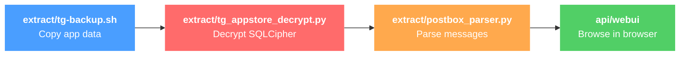

# Telegram Data Viewer

macOS toolkit for extracting, decrypting, and browsing Telegram messages — including deleted messages and secret chats.

> All processing is local and offline. No network connections, no API calls.

## How it works



`./tg-viewer full` runs the entire pipeline in one command.

## Quick start

```bash
# 1. Install dependencies
pip install -r requirements.txt

# 2. Full automated workflow (backup + decrypt + parse + web UI)
./tg-viewer full

# 3. Clean up when done
./tg-viewer clean
```

> Quit Telegram before running backup to avoid database locks.

## Commands

| Command | Description |
|---------|-------------|
| `./tg-viewer full [DIR]` | Run complete workflow: backup, decrypt, parse, web UI |
| `./tg-viewer backup [DIR]` | Create backup of Telegram data |
| `./tg-viewer decrypt DIR` | Decrypt databases (App Store `.tempkeyEncrypted`) |
| `./tg-viewer parse DIR` | Parse Postbox binary format into messages/peers/conversations |
| `./tg-viewer webui DIR` | Start web UI to browse parsed data |
| `./tg-viewer clean` | Remove all backup, decrypted, and parsed data |
| `./tg-viewer setup` | Install Python dependencies |

## Web UI

Served at `http://127.0.0.1:5000`.

| Tab | What it shows |
|-----|---------------|
| **Messages** | Flat list of all messages, search across all conversations |
| **Chats** | Conversation list with type filters (Secret, Cached/Deleted, Users, Channels, Bots, Groups) |
| **Media** | Grid of every cached file with thumbnails, type filters, and lightbox preview |
| **Users** | All peers with names, usernames, and phone numbers |
| **Databases** | Per-account decryption status |

## Supported Telegram versions

| Version | Location | Status |
|---------|----------|--------|
| App Store | `~/Library/Group Containers/6N38VWS5BX.ru.keepcoder.Telegram` | Full support |
| Desktop | `~/Library/Application Support/Telegram Desktop` | Backup only |
| Standalone | `~/Library/Application Support/Telegram` | Backup only |

## Requirements

- macOS with Telegram installed
- Python 3.7+
- Dependencies: `sqlcipher3`, `cryptography`, `fastapi`, `uvicorn`, `pydantic`

## Documentation

- [docs/usage.md](docs/usage.md) — step-by-step usage and common scenarios (re-parse, custom passcode, `--redact`, multi-account, jq queries)
- [docs/architecture.md](docs/architecture.md) — subsystem layout, scripts table, decryption flow, key derivation, Postbox schema
- [docs/output-format.md](docs/output-format.md) — `parsed_data/` tree and JSON shape of messages and media entries
- [docs/api.md](docs/api.md) — Swagger / ReDoc / OpenAPI schema endpoints
- [docs/troubleshooting.md](docs/troubleshooting.md) — common failure modes and fixes

## License

MIT — see [LICENSE](LICENSE).
