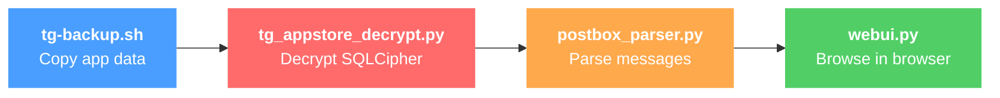
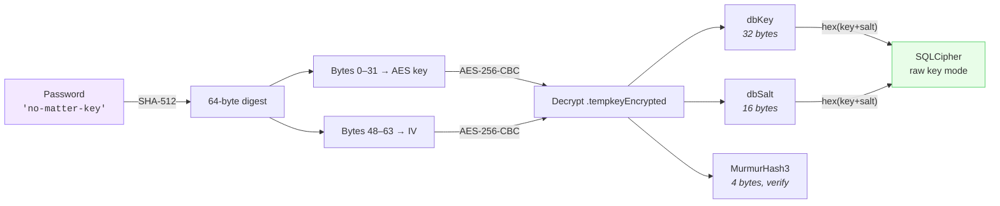
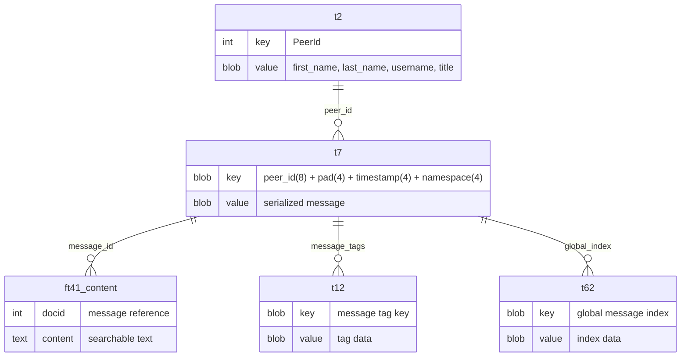

# Telegram Data Viewer

macOS toolkit for extracting, decrypting, and browsing Telegram messages — including deleted messages and secret chats.

> All processing is local and offline. No network connections, no API calls.

## How it works



`./tg-viewer full` runs the entire pipeline in one command.

## Quick start

```bash
# 1. Install dependencies
pip install -r requirements.txt

# 2. Full automated workflow (backup + decrypt + parse + web UI)
./tg-viewer full

# 3. Clean up when done
./tg-viewer clean
```

> Quit Telegram before running backup to avoid database locks.

## Step-by-step usage

```bash
./tg-viewer backup ./data           # Copy Telegram data
./tg-viewer decrypt ./data/tg_*/    # Decrypt databases
./tg-viewer parse ./data/tg_*/      # Parse messages into conversations
./tg-viewer webui ./data/tg_*/parsed_data   # Browse in web UI
```

Or call the scripts directly:

```bash
./tg-backup.sh ./data
python3 tg_appstore_decrypt.py ./data/tg_*/
python3 postbox_parser.py ./data/tg_*/
python3 webui.py ./data/tg_*/parsed_data
```

### Extraction results

From a real run on 3 accounts:

| Metric | Result |
|--------|--------|
| Databases decrypted | 3/3 (100%) |
| Messages extracted | 1,105,979 |
| Peers identified | 69,596 |
| Conversations | 374 |
| Secret chats decoded | 24 (13 peer names resolved) |
| Metadata noise | 0% |

## Commands

| Command | Description |
|---------|-------------|
| `./tg-viewer full [DIR]` | Run complete workflow: backup, decrypt, parse, web UI |
| `./tg-viewer backup [DIR]` | Create backup of Telegram data |
| `./tg-viewer decrypt DIR` | Decrypt databases (App Store `.tempkeyEncrypted`) |
| `./tg-viewer parse DIR` | Parse Postbox binary format into messages/peers/conversations |
| `./tg-viewer webui DIR` | Start web UI to browse parsed data |
| `./tg-viewer clean` | Remove all backup, decrypted, and parsed data |
| `./tg-viewer setup` | Install Python dependencies |

## Architecture

### Decryption flow


### Key derivation



### Scripts

| File | Purpose |
|------|---------|
| `tg-viewer` | CLI orchestrator — runs the full pipeline or individual steps |
| `tg-backup.sh` | Copies Telegram data from App Store / Desktop / Standalone |
| `tg_appstore_decrypt.py` | Decrypts `.tempkeyEncrypted` and opens SQLCipher databases |
| `postbox_parser.py` | Parses Postbox binary format — extracts messages, peers, conversations from t2/t7/ft41 |
| `webui.py` | Flask web UI for browsing messages |
| `extract-keys.sh` | Extracts encryption keys from macOS Keychain (legacy) |
| `tg_decrypt.py` | Legacy decryptor — tries multiple key formats via sqlcipher3 |

### Postbox database schema

Telegram stores data in numbered tables with binary-serialized values:



Peer data uses tagged binary fields: `02` + tag(2b) + `04` + length(uint32 LE) + UTF-8 string.
Channel titles use: `01` + `t` + `04` + length(uint32 LE) + string.
Secret chat remote peer is in field `r`: `01` + `72` + `01` + user_id(LE int32/int64).

## Output format

```
parsed_data/
  summary.json                     # Export metadata
  account-{id}/
    peers.json                     # All peers with names, usernames, phones
    messages.json                  # All messages with timestamps
    conversations_index.json       # Conversation list sorted by message count
    conversations/
      {username_or_name}.json      # Individual conversation with full history
```

<details>
<summary>Example message JSON</summary>

```json
{
  "peer_id": 11049657091,
  "text": "Message content here",
  "timestamp": 1764974409,
  "date": "2025-12-05T22:40:09+00:00",
  "peer_name": "Channel Name",
  "peer_username": "channel_handle"
}
```

</details>

## Supported Telegram versions

| Version | Location | Status |
|---------|----------|--------|
| App Store | `~/Library/Group Containers/6N38VWS5BX.ru.keepcoder.Telegram` | Full support |
| Desktop | `~/Library/Application Support/Telegram Desktop` | Backup only |
| Standalone | `~/Library/Application Support/Telegram` | Backup only |

## Requirements

- macOS with Telegram installed
- Python 3.7+
- Dependencies: `sqlcipher3`, `cryptography`, `flask`, `flask-cors`, `jinja2`

## Troubleshooting

<details>
<summary><b>Decryption fails with "file is not a database"</b></summary>

- Ensure `PRAGMA cipher_default_plaintext_header_size = 32` is set BEFORE the key
- Check that `.tempkeyEncrypted` exists in the backup directory

</details>

<details>
<summary><b>No keys found in keychain</b></summary>

- For App Store version: keys are in `.tempkeyEncrypted`, not keychain. Use `tg_appstore_decrypt.py`
- For Desktop version: check `key_data` file in tdata directory

</details>

<details>
<summary><b>Database locked</b></summary>

- Quit Telegram completely: `killall Telegram`

</details>

<details>
<summary><b>Custom passcode set</b></summary>

- Pass it as an argument: `python3 tg_appstore_decrypt.py ./data --password "your_passcode"`

</details>

## License

Private and proprietary.
