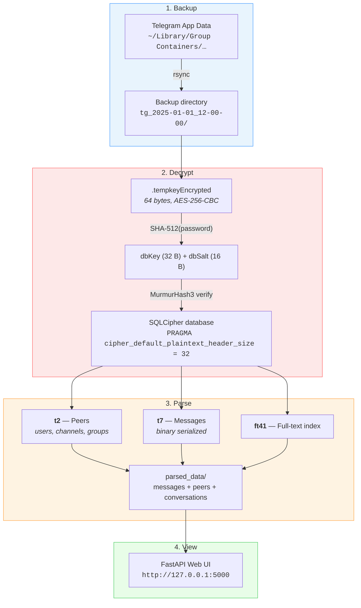
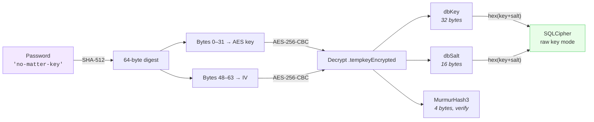
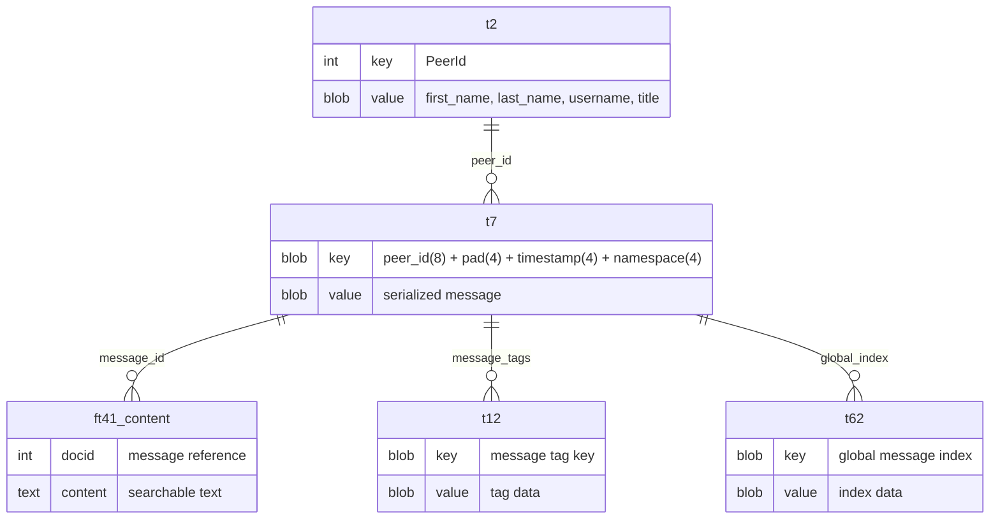

# Architecture

How `tg-viewer` is laid out internally — subsystems, scripts, decryption flow, key derivation, and the Postbox database schema.

## Subsystems

The codebase is organised into three subsystems:

- `extract/` — backup + decryption + Postbox parsing (Python + bash)
- `api/` — FastAPI backend package and transitional templates
- `web/` — Phase 2b React + Bun frontend (placeholder)

## Scripts

| File | Purpose |
|------|---------|
| `tg-viewer` | CLI orchestrator — runs the full pipeline or individual steps |
| `extract/tg-backup.sh` | Copies Telegram data from App Store / Desktop / Standalone |
| `extract/tg_appstore_decrypt.py` | Decrypts `.tempkeyEncrypted` and opens SQLCipher databases |
| `extract/postbox_parser.py` | Parses Postbox binary format — extracts messages, peers, conversations from t2/t7/ft41 |
| `api/webui/` | FastAPI web UI package for browsing messages (entrypoint: `python -m webui`, run with `cwd=api/`) |
| `web/` | React + Bun frontend — built to `web/dist/` and served by FastAPI's StaticFiles |
| `extract/extract-keys.sh` | Extracts encryption keys from macOS Keychain (legacy) |
| `extract/tg_decrypt.py` | Legacy decryptor — tries multiple key formats via sqlcipher3 |

## Decryption flow

## Key derivation

## Postbox database schema

Telegram stores data in numbered tables with binary-serialized values:

Peer data uses tagged binary fields: `02` + tag(2b) + `04` + length(uint32 LE) + UTF-8 string.
Channel titles use: `01` + `t` + `04` + length(uint32 LE) + string.
Secret chat remote peer is in field `r`: `01` + `72` + `01` + user_id(LE int32/int64).
